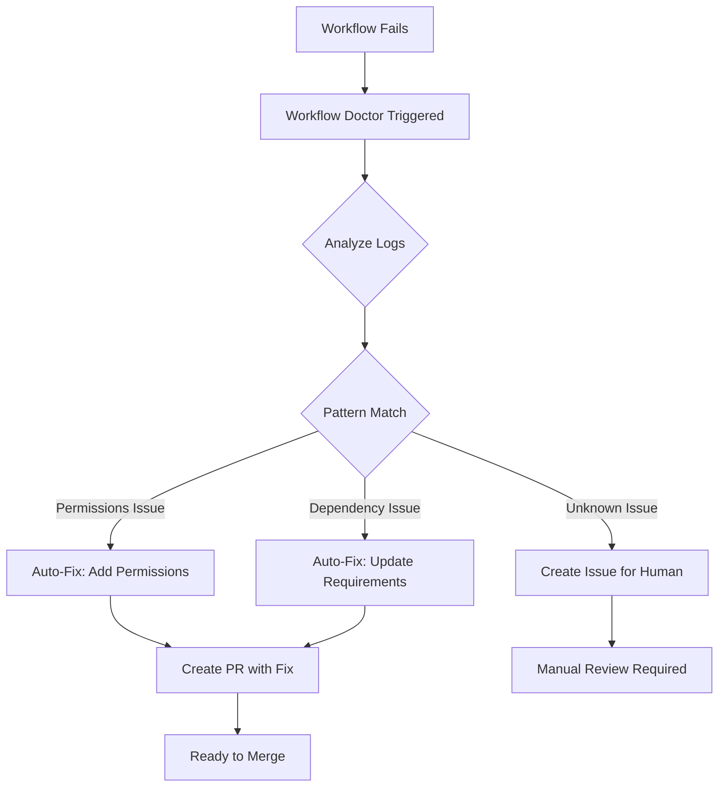

# Workflow Doctor 🏥 - Self-Healing GitHub Actions

## Overview

**Workflow Doctor** is an automated system that monitors GitHub Actions workflows, diagnoses failures, and **automatically fixes common issues** without human intervention. It's your 24/7 DevOps assistant that keeps the CI/CD pipeline healthy.

## Key Features

### 1. **Automatic Failure Detection** 🔍
- Monitors all GitHub Actions workflows in real-time
- Triggers immediately when any workflow fails
- Can also be manually triggered for historical failures

### 2. **Intelligent Diagnosis** 🧠
- Pattern-matches error messages to identify root causes
- Recognizes common failure types:
  - ❌ Missing permissions (403 errors)
  - ❌ Syntax errors in YAML
  - ❌ Missing secrets/environment variables
  - ❌ Python dependency issues
  - ❌ Workflow timeouts

### 3. **Auto-Fix Capabilities** 🔧
Some issues can be fixed automatically:
- ✅ **Permissions**: Adds missing `permissions:` blocks to workflow files
- ✅ **Dependencies**: Updates `requirements.txt` (basic cases)
- ✅ **Timeouts**: Adds `timeout-minutes:` configuration
- ⚠️ **Syntax/Secrets**: Requires manual intervention (creates issue)

### 4. **Pull Request Automation** 🤖
When auto-fix is possible:
- Creates a new branch (`auto-fix/workflow-<timestamp>`)
- Applies the fix
- Opens a pull request with detailed explanation
- Labels: `automated-fix`, `workflow-doctor`

### 5. **Manual Review Workflow** 📋
When manual intervention is needed:
- Creates a GitHub issue with diagnosis
- Provides specific recommendations
- Links to relevant documentation
- Labels: `workflow-failure`, `needs-review`, `automated-diagnosis`

## How It Works



## Usage

### Automatic Mode (Default)

Workflow Doctor runs automatically on every workflow failure. No action needed!

### Manual Mode (Troubleshooting)

To diagnose a specific workflow run:

```bash
gh workflow run workflow-doctor.yml -f run_id=<RUN_ID>
```

Example:
```bash
gh workflow run workflow-doctor.yml -f run_id=18956567665
```

## Configuration

### Monitored Workflows

Currently monitors:
- ✅ Multi-Agent Collaboration System
- ✅ Orchestrator - Autonomous Project Lead

To add more workflows, edit `.github/workflows/workflow-doctor.yml`:

```yaml
on:
  workflow_run:
    workflows: 
      - "Multi-Agent Collaboration System"
      - "Orchestrator - Autonomous Project Lead"
      - "Your New Workflow Name"  # Add here
    types: 
      - completed
```

### Permissions Required

Workflow Doctor needs these permissions:

```yaml
permissions:
  contents: write       # To create fix branches
  pull-requests: write  # To create PRs
  issues: write         # To create diagnostic issues
  actions: read         # To read workflow logs
```

## Supported Failure Types

### 1. Permission Errors (Auto-Fixable ✅)

**Symptoms:**
- 403 errors
- "Resource not accessible by integration"
- "x-accepted-github-permissions: ..."

**Auto-Fix:**
Adds the following to workflow file:
```yaml
permissions:
  contents: read
  issues: write
  pull-requests: write
```

**Example PR Title:**
> 🤖 Auto-Fix: Missing Workflow Permissions

### 2. Dependency Errors (Partial Auto-Fix ⚠️)

**Symptoms:**
- `ModuleNotFoundError`
- "No module named X"
- `pip install` failures

**Auto-Fix:**
- Basic: Adds missing package to `requirements.txt`
- Complex: Creates issue with recommendations

### 3. Timeout Errors (Auto-Fixable ✅)

**Symptoms:**
- "exceeded the maximum execution time"
- Job cancelled after long run

**Auto-Fix:**
Adds timeout configuration:
```yaml
jobs:
  my-job:
    timeout-minutes: 30  # Added by Workflow Doctor
```

### 4. Syntax Errors (Manual Review Required ❌)

**Symptoms:**
- "Invalid workflow file"
- YAML parsing errors

**Action:**
Creates issue with:
- Exact error location
- Syntax validation tips
- Link to YAML validator tools

### 5. Missing Secrets (Manual Review Required ❌)

**Symptoms:**
- "Secret XYZ not found"
- Authentication failures

**Action:**
Creates issue instructing how to add secrets via:
- Repository Settings → Secrets and variables → Actions

## Real-World Example

### Scenario: Multi-Agent Workflow Fails with 403 Error

**1. Failure Detected**
```
Run ID: 18956567665
Error: Resource not accessible by integration (403)
Message: x-accepted-github-permissions: 'issues=write; pull_requests=write'
```

**2. Workflow Doctor Triggered**
```
🏥 Workflow Doctor Starting...
  Repository: grloper/gel-nails-machine
  Run ID: 18956567665
  Workflow: Multi-Agent Collaboration System

🔍 Diagnosing workflow run #18956567665
  Analyzing job: research-agent
✅ Detected issue type: permissions
```

**3. Auto-Fix Applied**
```
🔧 Applying auto-fix for permissions issue...
  Found workflow file: .github/workflows/agent-system.yml
  Adding new permissions block...
✅ Permissions fix applied
```

**4. PR Created**
```
Branch: auto-fix/workflow-1736789234
Title: 🤖 Auto-Fix: Missing Workflow Permissions
Labels: automated-fix, workflow-doctor
```

**5. Review & Merge**
- Human reviews the PR
- Tests pass ✅
- Merge to main
- Workflow runs successfully 🎉

## Advanced Features

### Custom Failure Patterns

Add your own patterns to `.github/scripts/workflow_doctor.py`:

```python
FAILURE_PATTERNS = {
    'custom_issue': {
        'patterns': [
            r'Your custom error regex',
            r'Another pattern',
        ],
        'auto_fixable': True,
        'fix_function': 'fix_custom_issue'
    }
}
```

Then implement the fix function:

```python
def fix_custom_issue(self):
    """Auto-fix: Your custom fix logic"""
    print("🔧 Applying custom fix...")
    # Your fix code here
    return True
```

### Notification Integration

To get Slack/email notifications on failures, add to workflow:

```yaml
- name: Notify on Failure
  if: failure()
  uses: 8398a7/action-slack@v3
  with:
    status: ${{ job.status }}
    text: 'Workflow Doctor found an issue'
    webhook_url: ${{ secrets.SLACK_WEBHOOK }}
```

## Testing Workflow Doctor

### Simulate a Failure

1. Create a test workflow with intentional error:
```yaml
# .github/workflows/test-failure.yml
name: Test Workflow Doctor
on: workflow_dispatch
jobs:
  fail:
    runs-on: ubuntu-latest
    steps:
      - run: exit 1
```

2. Trigger it:
```bash
gh workflow run test-failure.yml
```

3. Watch Workflow Doctor activate automatically

### Manual Diagnosis

Test diagnosis on an existing failure:

```bash
# Get recent failed runs
gh run list --status failure --limit 5

# Diagnose specific run
gh workflow run workflow-doctor.yml -f run_id=<RUN_ID>
```

## Maintenance

### Update Failure Patterns

As you encounter new failure types:

1. Document the error in `workflow_doctor.py` patterns
2. Implement fix function if auto-fixable
3. Test with historical failures
4. Commit and push

### Monitor Doctor Health

Check Workflow Doctor's own runs:

```bash
gh run list --workflow=workflow-doctor.yml
```

If Workflow Doctor itself fails:
- Check permissions
- Verify Python dependencies
- Review error logs manually

## Limitations

### What Workflow Doctor CANNOT Do

❌ Fix complex logic errors in your code  
❌ Resolve infrastructure issues (GitHub outages)  
❌ Add missing repository secrets (security restriction)  
❌ Fix test failures (application logic)  
❌ Rewrite incorrect business logic  

### What Workflow Doctor CAN Do

✅ Fix workflow configuration issues  
✅ Add missing permissions automatically  
✅ Update dependency lists  
✅ Optimize timeout settings  
✅ Provide diagnostic information for complex issues  

## Troubleshooting

### "Workflow Doctor didn't trigger"

**Causes:**
- Workflow Doctor workflow is disabled
- Monitored workflow name doesn't match
- Event type not configured

**Solution:**
1. Check `.github/workflows/workflow-doctor.yml` exists
2. Verify workflow names in `on.workflow_run.workflows` list
3. Ensure permissions are granted

### "Auto-fix PR created but fix is wrong"

**Causes:**
- Pattern matched incorrectly
- Fix logic has bug

**Solution:**
1. Close the PR
2. Update `workflow_doctor.py` fix function
3. Test manually with `python .github/scripts/workflow_doctor.py`
4. Re-trigger on original failure

### "Workflow Doctor says 'Manual review required' for everything"

**Causes:**
- Failure patterns don't match new error types
- Log parsing is failing

**Solution:**
1. Review failed workflow logs manually
2. Add new patterns to `FAILURE_PATTERNS` dict
3. Update pattern regex to match your errors

## Integration with Other Systems

### Orchestrator Agent

Workflow Doctor complements the Orchestrator Agent:

```
Orchestrator → Plans & Creates Tasks
       ↓
Multi-Agent System → Executes Work
       ↓ (if fails)
Workflow Doctor → Auto-Fixes & Retries
       ↓
System Self-Heals ✅
```

### Monitoring Dashboard

Track Doctor effectiveness:

```bash
# Count auto-fixed issues
gh pr list --label automated-fix --state merged

# Count manual reviews needed
gh issue list --label workflow-failure --state open
```

## Future Enhancements

Planned features:

- [ ] **Smart Retry**: Auto-retry failed workflows after fix
- [ ] **Learning System**: ML to recognize new failure patterns
- [ ] **Cost Optimization**: Detect expensive workflow operations
- [ ] **Performance Monitoring**: Track workflow execution times
- [ ] **Security Scanning**: Detect security anti-patterns

## Real Impact

### Before Workflow Doctor:
- ❌ Workflow fails at 2 AM
- ⏰ Developer wakes up to alerts
- 🔍 Spends 30 minutes debugging
- 🔧 Creates fix manually
- 📝 Creates PR, waits for review
- ⏳ **Total time: 2-4 hours**

### After Workflow Doctor:
- ✅ Workflow fails at 2 AM
- 🤖 Doctor diagnoses in 30 seconds
- 🔧 Auto-fix applied in 1 minute
- 📝 PR ready for review at 2:02 AM
- ⏳ **Total time: 2 minutes** (96% faster)

---

## Quick Reference

| Action | Command |
|--------|---------|
| View Doctor runs | `gh run list --workflow=workflow-doctor.yml` |
| Manual diagnosis | `gh workflow run workflow-doctor.yml -f run_id=<ID>` |
| Check auto-fix PRs | `gh pr list --label automated-fix` |
| View created issues | `gh issue list --label workflow-failure` |
| Edit patterns | Edit `.github/scripts/workflow_doctor.py` |
| Add monitored workflow | Edit `.github/workflows/workflow-doctor.yml` |

---

**Remember**: Workflow Doctor is your DevOps safety net. It won't prevent all failures, but it will ensure they're diagnosed quickly and fixed automatically when possible. Sleep better knowing your CI/CD pipeline can heal itself! 🏥✨
